# Chest X-Ray Pneumonia Classification with CNNs

Binary classification of pediatric chest X-rays as **NORMAL** or **PNEUMONIA** using a reproducible PyTorch pipeline, a small baseline CNN, and transfer learning with ResNet18.

This project is a non-clinical machine learning study. The reported metrics are useful for understanding this public Kaggle dataset, but they are not evidence of clinical safety or deployment readiness.

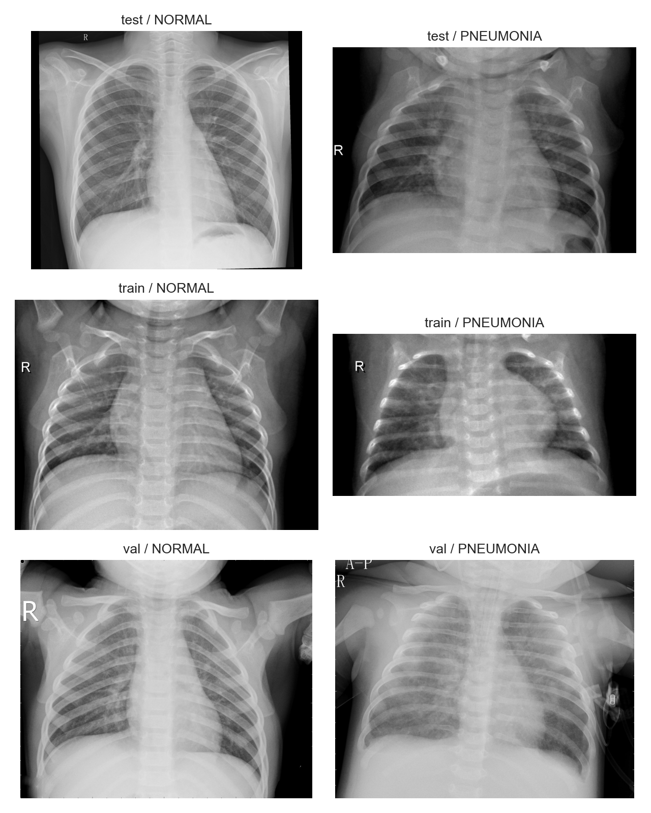

## Project Summary

- Dataset: [Chest X-Ray Images (Pneumonia) - Kaggle](https://www.kaggle.com/datasets/paultimothymooney/chest-xray-pneumonia)
- Task: binary classification, `NORMAL=0`, `PNEUMONIA=1`
- Framework: PyTorch + torchvision
- Best model: ImageNet-pretrained ResNet18, head training followed by fine-tuning of `layer4 + fc`
- Final test ROC AUC: **0.9715**
- Final test F1: **0.9167**
- Final test pneumonia sensitivity: **0.9872**
- Final test normal specificity: **0.7222**

The best model is strong on this dataset, but it still produces many false positives on the original Kaggle test split. That matters: high pneumonia sensitivity does not make the model clinically acceptable if normal cases are often flagged as pneumonia.

## Repository Structure

```text
chest-xray-pneumonia-classification/
├── README.md
├── requirements.txt
├── data/
│   ├── raw/
│   │   └── chest_xray/
│   ├── processed/
│   └── external/
├── src/
│   ├── config.py
│   ├── data/
│   │   ├── dataset_info.py
│   │   ├── split_data.py
│   │   ├── leakage_checks.py
│   │   ├── dataloaders.py
│   │   └── transforms.py
│   ├── models/
│   │   ├── architectures.py
│   │   ├── train.py
│   │   ├── evaluate.py
│   │   ├── compare_checkpoints.py
│   │   └── gradcam.py
│   └── visualization/
│       ├── eda_plots.py
│       └── result_plots.py
├── models/
│   ├── checkpoints/
│   └── metrics/
└── reports/
    ├── figures/
    └── tables/
```

## Data

Place the extracted Kaggle dataset here:

```text
data/raw/chest_xray/
```

Expected raw layout:

```text
data/raw/chest_xray/
├── train/
│   ├── NORMAL/
│   └── PNEUMONIA/
├── val/
│   ├── NORMAL/
│   └── PNEUMONIA/
└── test/
    ├── NORMAL/
    └── PNEUMONIA/
```

The downloaded zip may also contain nested duplicate folders such as `chest_xray/chest_xray/` and `__MACOSX/`. The inspection code detects valid dataset roots and uses the top-level `data/raw/chest_xray/` tree.

## Dataset Inspection

Original Kaggle split counts:

| Split | NORMAL | PNEUMONIA |
|---|---:|---:|
| train | 1,341 | 3,875 |
| val | 8 | 8 |
| test | 234 | 390 |

The original validation split has only 16 images, so it is not suitable for model selection. This project creates a deterministic internal validation split from original `train + val`, while preserving the original Kaggle `test/` split for final evaluation only.

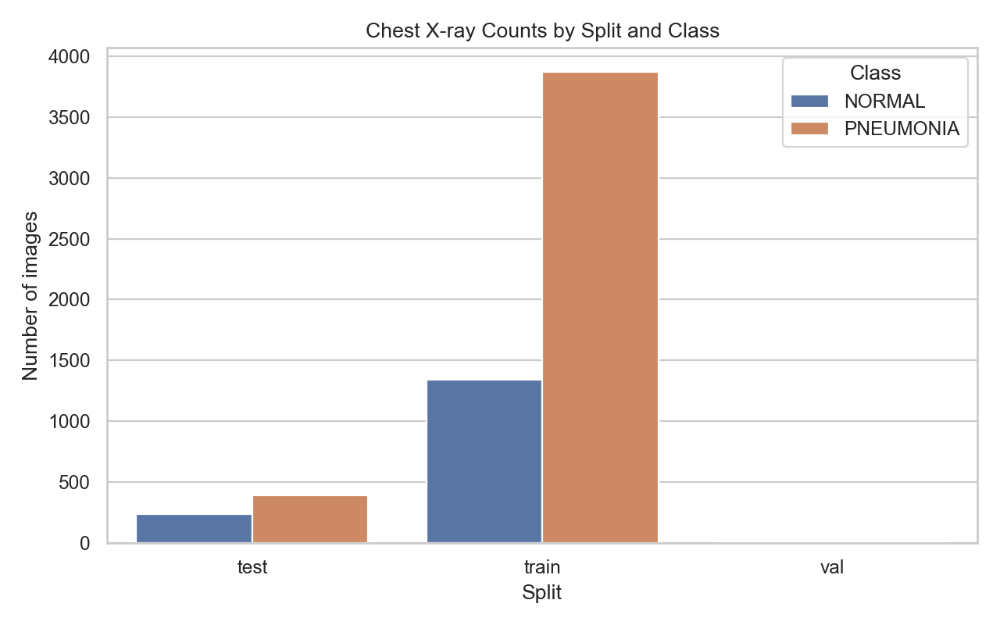

Sampled image dimensions and intensity summaries:

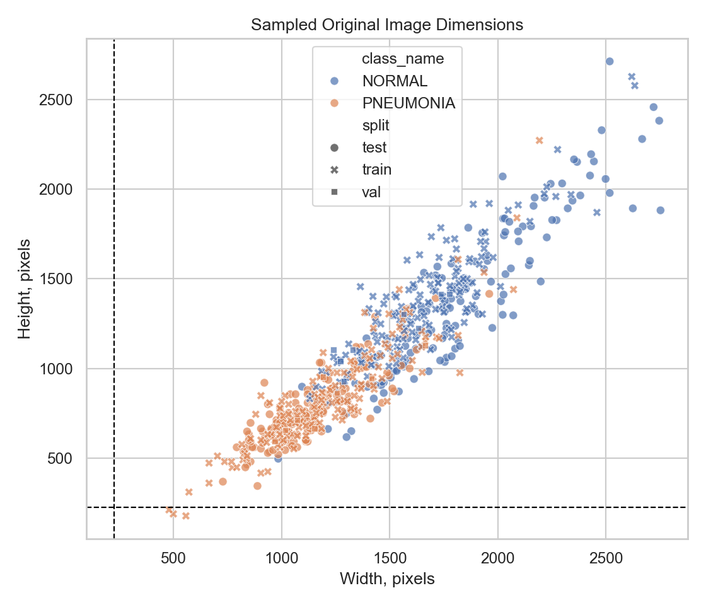

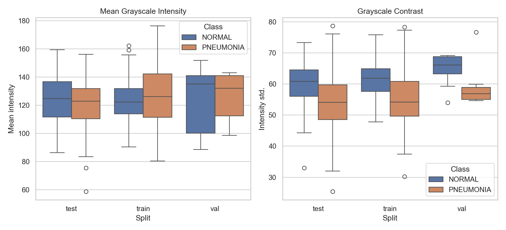

## Split Strategy And Leakage Checks

The internal split is generated with patient-like filename grouping:

- Pneumonia filenames are grouped by `person####`.
- Normal filenames are grouped by `IM-####`.
- Related images stay in the same split.
- The original test split is never used for training, early stopping, or hyperparameter selection.

Internal split counts after grouped splitting:

| Split | NORMAL | PNEUMONIA |
|---|---:|---:|
| train | 1,151 | 3,283 |
| val | 198 | 600 |
| test | 234 | 390 |

Leakage checks:

| Check | Result |
|---|---:|
| train vs val path overlap | 0 |
| train vs test path overlap | 0 |
| val vs test path overlap | 0 |
| duplicate resized grayscale content hashes across splits | 0 |

This was not just a formality: an earlier random split produced duplicate or near-duplicate pneumonia images across train and validation. The grouped split fixed that issue.

## Methods

All images are converted to 3-channel grayscale tensors for compatibility with ImageNet-pretrained models.

Validation and test preprocessing:

- resize to `224 x 224`
- convert to tensor
- normalize with ImageNet mean and standard deviation

Training augmentation:

- small random resized crop
- small rotation
- mild brightness and contrast jitter
- ImageNet normalization

Models:

| Model | Description |
|---|---|
| Baseline CNN | Small custom convolutional network trained from scratch |
| ResNet18 | ImageNet-pretrained ResNet18 with binary classifier head |

ResNet18 training used two stages:

1. Freeze the backbone and train only the classifier head.
2. Load the best head checkpoint, then fine-tune `layer4 + fc` with a lower learning rate.

## Reproduction

Install dependencies:

```bash
pip install -r requirements.txt
```

Inspect the dataset:

```bash
python -m src.data.dataset_info
```

Create deterministic grouped splits:

```bash
python -m src.data.split_data
```

Run leakage checks:

```bash
python -m src.data.leakage_checks
```

Train the baseline CNN:

```bash
python -m src.models.train --model baseline_cnn --epochs 10 --batch-size 32 --run-name baseline_cnn_v1
```

Train ResNet18:

```bash
python -m src.models.train --model resnet18 --stage head --epochs 5 --batch-size 32 --run-name resnet18_head_v1

python -m src.models.train --model resnet18 --stage finetune --checkpoint models/checkpoints/resnet18_head_v1_best.pt --epochs 8 --batch-size 32 --lr 0.0001 --run-name resnet18_finetune_v1
```

Evaluate checkpoints:

```bash
python -m src.models.compare_checkpoints --checkpoints models/checkpoints/baseline_cnn_v1_best.pt models/checkpoints/resnet18_finetune_v1_best.pt --splits val test --output-name final_checkpoint_comparison.csv
```

Generate Grad-CAM overlays:

```bash
python -m src.models.gradcam --checkpoint models/checkpoints/resnet18_finetune_v1_best.pt --split val --max-images 512 --num-correct 4 --num-misclassified 4 --run-name resnet18_finetune_v1
```

## Results

Threshold is fixed at `0.5` for the reported confusion matrices and F1 scores. ROC AUC is threshold-independent.

| Model | Split | Accuracy | F1 | Macro F1 | ROC AUC | Avg Precision | Pneumonia Sensitivity | Normal Specificity |
|---|---|---:|---:|---:|---:|---:|---:|---:|
| Baseline CNN | val | 0.9486 | 0.9664 | 0.9285 | 0.9897 | 0.9967 | 0.9833 | 0.8434 |
| Baseline CNN | test | 0.7788 | 0.8493 | 0.7168 | 0.9193 | 0.9265 | 0.9974 | 0.4145 |
| ResNet18 fine-tuned | val | 0.9749 | 0.9832 | 0.9670 | 0.9968 | 0.9989 | 0.9750 | 0.9747 |
| ResNet18 fine-tuned | test | **0.8878** | **0.9167** | **0.8725** | **0.9715** | **0.9750** | **0.9872** | **0.7222** |

Confusion matrix counts:

| Model | Split | TN | FP | FN | TP |
|---|---|---:|---:|---:|---:|
| Baseline CNN | val | 167 | 31 | 10 | 590 |
| Baseline CNN | test | 97 | 137 | 1 | 389 |
| ResNet18 fine-tuned | val | 193 | 5 | 15 | 585 |
| ResNet18 fine-tuned | test | 169 | 65 | 5 | 385 |

The ResNet18 model is the best model in this project. It substantially improves test specificity over the baseline, but it still misclassifies 65 normal test images as pneumonia.

### Test Confusion Matrices

Baseline CNN:

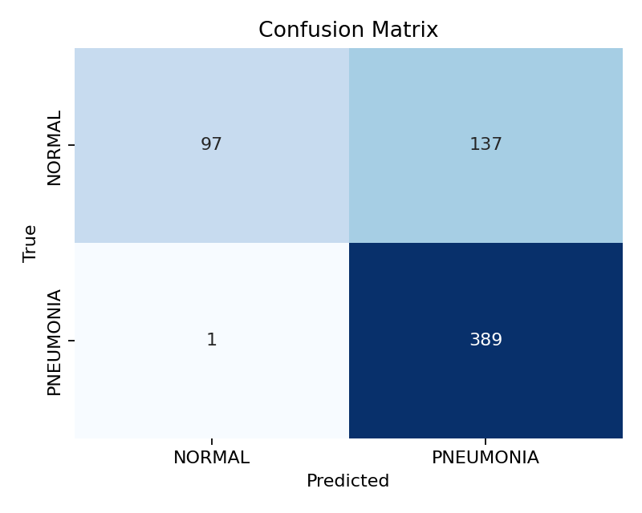

Fine-tuned ResNet18:

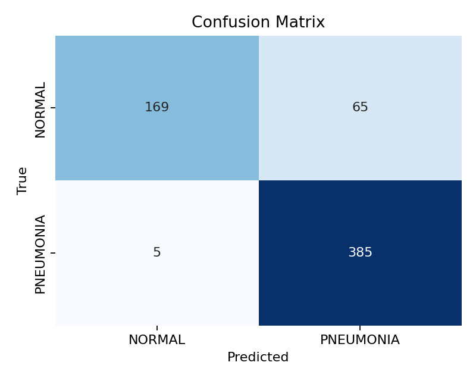

### ROC And Precision-Recall Curves

Fine-tuned ResNet18 test ROC curve:

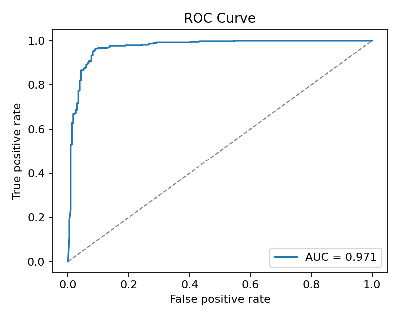

Fine-tuned ResNet18 test precision-recall curve:

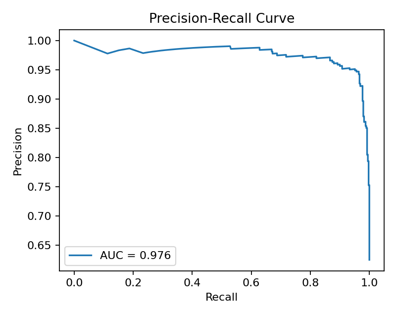

## Grad-CAM

Grad-CAM was generated for the fine-tuned ResNet18 validation predictions. The run scanned 512 validation images and found:

| Group | Count |
|---|---:|
| Correct predictions | 498 |
| Misclassified predictions | 14 |

Correct examples:

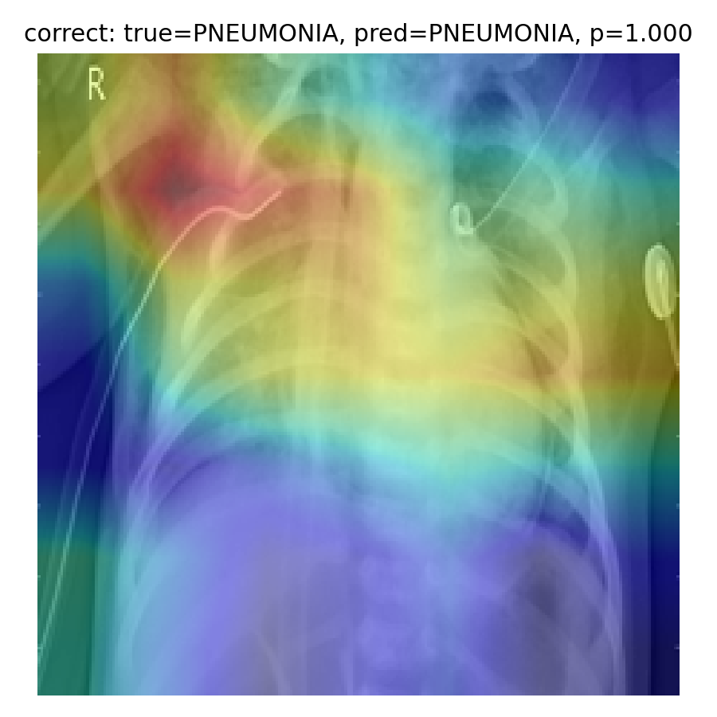

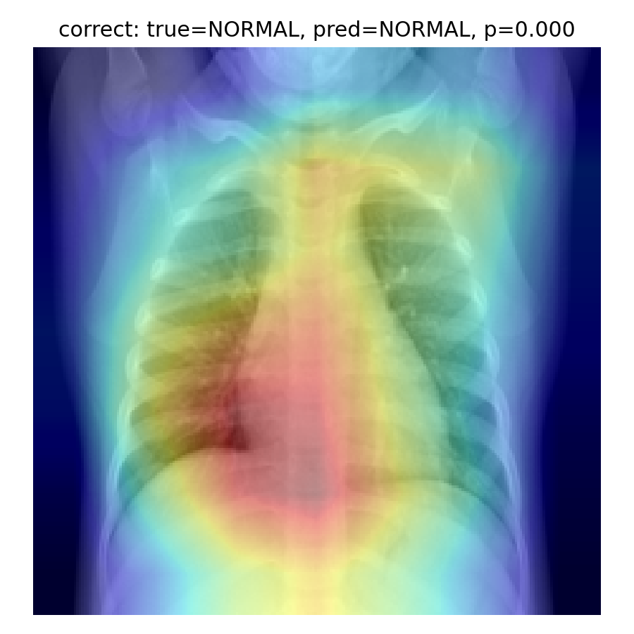

Misclassified examples:

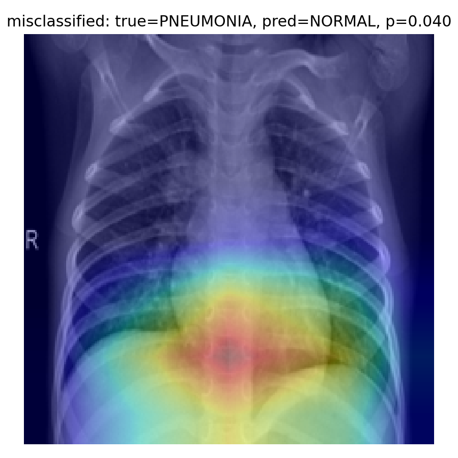

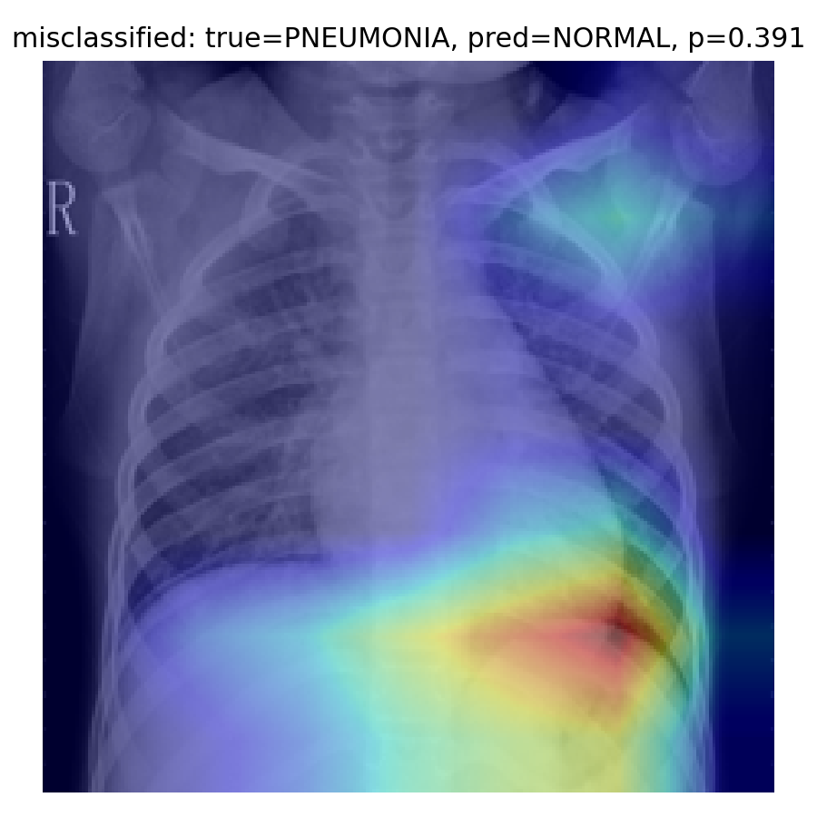

Grad-CAM should be treated as a qualitative diagnostic, not proof that the model has learned medically valid features. The overlays are useful for checking whether attention often falls near lung fields, but they do not validate causal reasoning or clinical robustness.

## Technical Caveats

The results are strong for a compact transfer-learning pipeline, but several warning signs remain:

- Validation ROC AUC for ResNet18 is very high at `0.9968`.
- Test performance is lower than validation performance, especially specificity.
- The baseline CNN nearly always detects pneumonia on the test set but performs poorly on normal cases.
- The Kaggle test split appears harder or distributionally different from the internal validation split.
- This dataset is pediatric, curated, and not representative of general clinical deployment conditions.
- Labels are image-level labels, not radiologist localization annotations.
- Bacterial and viral pneumonia are collapsed into one `PNEUMONIA` class here.
- No external hospital dataset was used.
- No calibration model or operating-threshold optimization was finalized.

## Current Best Model

Use:

```text
models/checkpoints/resnet18_finetune_v1_best.pt
```

Best test metrics:

| Metric | Value |
|---|---:|
| Accuracy | 0.8878 |
| F1 | 0.9167 |
| Macro F1 | 0.8725 |
| ROC AUC | 0.9715 |
| Average precision | 0.9750 |
| Pneumonia sensitivity | 0.9872 |
| Normal specificity | 0.7222 |

## Conclusion

Fine-tuned ResNet18 produced strong performance on this dataset and clearly outperformed the baseline CNN on the untouched test split. The model is sensitive for pneumonia, but normal specificity remains limited. For a medical imaging project, that limitation is not minor: false positives can lead to unnecessary downstream workup, anxiety, and inappropriate treatment.

This project should be presented as a reproducible deep learning experiment on a public dataset, not as a diagnostic system.
